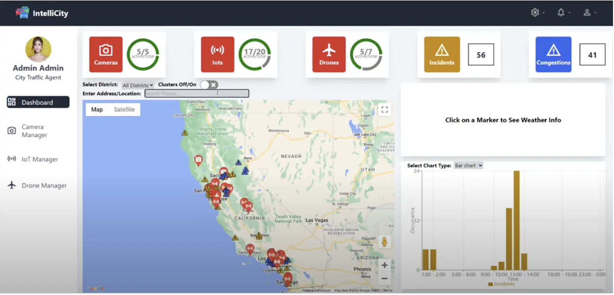
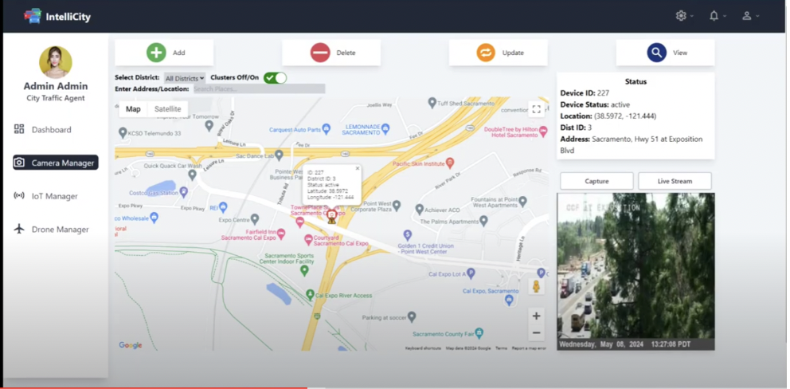
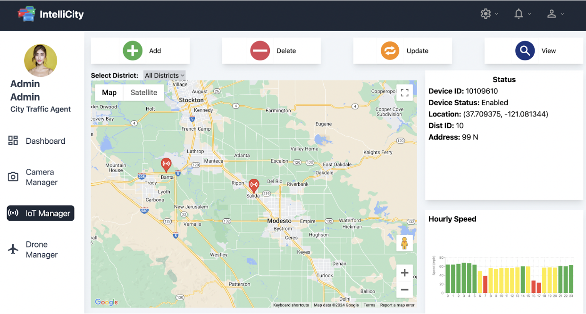
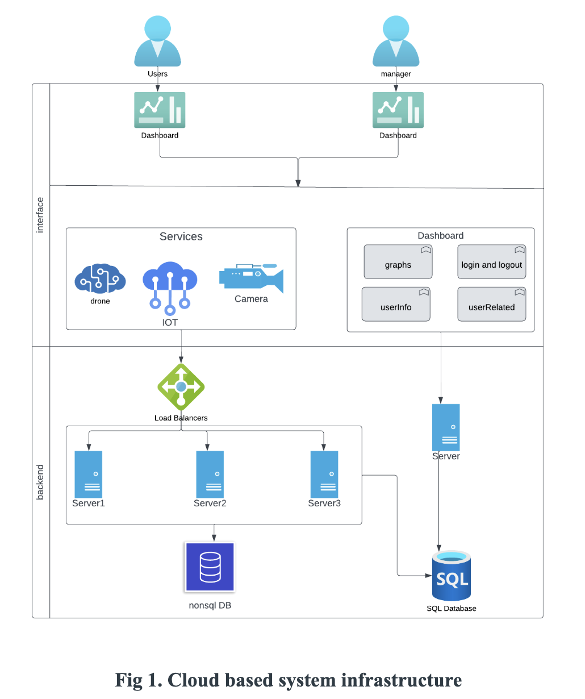
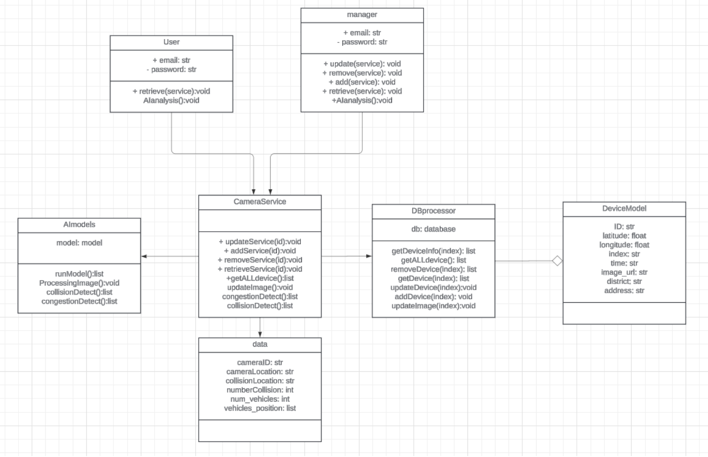
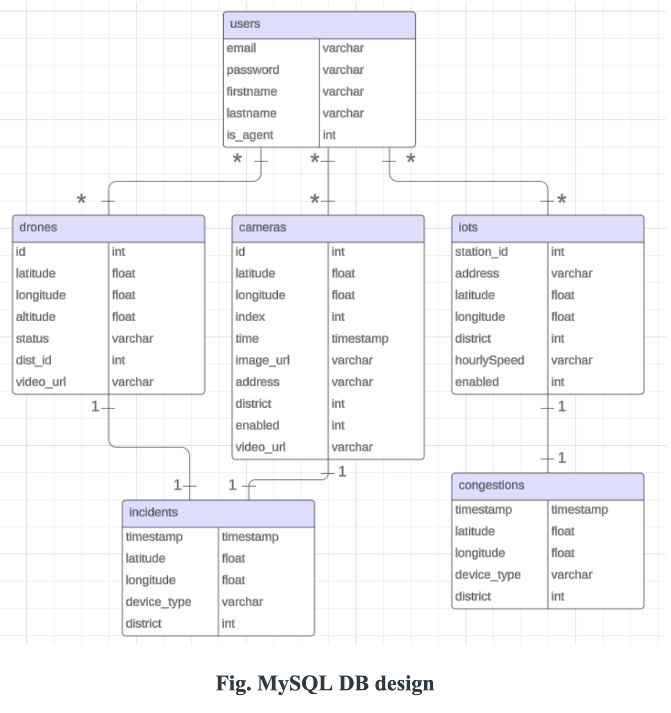

# Smart City Traffic AI Cloud Platform

<div align="center">


_A comprehensive cloud-based intelligent traffic management system leveraging AI, IoT, and big data analytics with modern full-stack architecture_

</div>

## 🚀 Project Overview

The **Smart City Traffic AI Cloud Platform** is an advanced, cloud-based intelligent traffic management system designed to revolutionize urban mobility through the integration of artificial intelligence, Internet of Things (IoT), and big data analytics. This platform provides real-time traffic monitoring, incident detection, congestion analysis, and predictive analytics to improve traffic flow and enhance public safety in smart cities.

Built with a modern full-stack architecture, the system combines a robust Django backend with a responsive React frontend, creating a seamless user experience for traffic management professionals and city administrators.

## ✨ Key Features

### 🎯 **AI-Powered Traffic Analysis**

- **Computer Vision**: Real-time vehicle detection and classification using YOLO models
- **Incident Detection**: Automated emergency and incident identification from CCTV feeds
- **Traffic Pattern Recognition**: Machine learning algorithms for traffic flow prediction
- **Real-time AI Processing**: Live video stream analysis with instant incident alerts

### 📊 **Real-time Data Processing**

- **Multi-source Integration**: CCTV cameras, IoT sensors, and drone imagery
- **Live Streaming**: Real-time video stream processing and analysis
- **Instant Alerts**: Real-time incident and congestion notifications
- **Data Visualization**: Interactive charts and maps for traffic analytics

### 🏗️ **Modern Full-Stack Architecture**

- **Django Backend**: RESTful API with microservices design
- **React Frontend**: Modern, responsive web interface with real-time updates
- **Scalable Infrastructure**: Built for high-performance cloud deployment
- **Modular Design**: Separate backend modules for different data sources

### 🔐 **Security & Authentication**

- **JWT Authentication**: Secure user authentication and authorization
- **Role-based Access**: Different access levels for traffic agents and public users
- **Data Encryption**: Secure data transmission and storage
- **Protected Routes**: Frontend route protection with authentication guards

## 📸 Demo Images

Here are some screenshots of the IntelliCity dashboard and system components:

### **Dashboard Overview**



### **Camera Monitoring**



### **IoT Device Management**



## 🏛️ System Architecture

### **Full-Stack System Design**


*System Architecure Diagram*


*Class UML Diagram*

### **Frontend Architecture (React)**

The React frontend is built with modern web technologies and follows best practices:

```
┌─────────────────────────────────────────────────────────────┐
│                    App.js (Main Component)                 │
├─────────────────────────────────────────────────────────────┤
│  ┌─────────────┐ ┌─────────────┐ ┌─────────────┐          │
│  │   Pages     │ │ Components  │ │   Utils     │          │
│  │             │ │             │ │             │          │
│  ├─────────────┤ ├─────────────┤ ├─────────────┤          │
│  │ Dashboard   │ │ Sidebar     │ │ Map Utils   │          │
│  │ CameraMgr   │ │ Topbar      │ │ Auth Utils  │          │
│  │ IotMgr      │ │ Charts      │ │ API Utils   │          │
│  │ DroneMgr    │ │ Tables      │ │             │          │
│  └─────────────┘ └─────────────┘ └─────────────┘          │
└─────────────────────────────────────────────────────────────┘
```

### **Backend Architecture (Django)**

The Django backend follows a microservices pattern with specialized modules:

```
┌─────────────────────────────────────────────────────────────┐
│                Django Project Core                         │
│              (smartcity_backend)                           │
├─────────────────────────────────────────────────────────────┤
│  ┌─────────────┐ ┌─────────────┐ ┌─────────────┐ ┌──────┐ │
│  │   Auth      │ │   Camera    │ │    IoT      │ │Drone │ │
│  │  System     │ │  Backend    │ │  Backend    │ │Backend│ │
│  └─────────────┘ └─────────────┘ └─────────────┘ └──────┘ │
├─────────────────────────────────────────────────────────────┤
│  ┌─────────────┐ ┌─────────────┐ ┌─────────────┐          │
│  │   Data      │ │   AI/ML     │ │   Celery    │          │
│  │  Backend    │ │  Models     │ │   Tasks     │          │
│  └─────────────┘ └─────────────┘ └─────────────┘          │
└─────────────────────────────────────────────────────────────┘
```

### **System Scalability & Load Balance Design**

Our platform implements a sophisticated multi-tier architecture for optimal performance and scalability:

```
┌─────────────────────────────────────────────────────────────┐
│                    User Layer                              │
│  ┌─────────────┐ ┌─────────────┐                          │
│  │   Mobile    │ │  Computer   │                          │
│  │   Users     │ │   Users     │                          │
│  └─────────────┘ └─────────────┘                          │
└─────────────────────────────────────────────────────────────┘
                              │
                              ▼
┌─────────────────────────────────────────────────────────────┐
│                Primary Load Balancer                       │
│              ┌─────────────────────┐                      │
│              │   Load Balancer     │                      │
│              └─────────────────────┘                      │
│                              │                            │
│  ┌─────────────┐ ┌─────────────┐                          │
│  │  Frontend   │ │   Backup    │                          │
│  │   Server    │ │   Servers   │                          │
│  └─────────────┘ └─────────────┘                          │
└─────────────────────────────────────────────────────────────┘
                              │
                              ▼
┌─────────────────────────────────────────────────────────────┐
│              Backend Service Distribution                  │
│  ┌─────────────┐ ┌─────────────┐ ┌─────────────┐          │
│  │   Camera    │ │    IoT      │ │   Drone     │          │
│  │   Server    │ │   Server    │ │   Server    │          │
│  │  + Backup   │ │  + Backup   │ │  + Backup   │          │
│  └─────────────┘ └─────────────┘ └─────────────┘          │
└─────────────────────────────────────────────────────────────┘
```

### **Cloud Infrastructure & Scalability**

Our platform is designed with enterprise-grade scalability and high availability:

- **Load Balancing**: Multi-tier load balancing for optimal resource distribution
- **Auto-scaling**: Dynamic server provisioning based on traffic demands
- **Geographic Distribution**: Multi-region deployment for global accessibility
- **Fault Tolerance**: Redundant systems and automatic failover mechanisms

### **Cloud Connectivity Design**

The platform utilizes AWS cloud infrastructure with optimized instance types:

```
┌─────────────────────────────────────────────────────────────┐
│              Application Frontend                          │
│                    (t2.medium)                             │
└─────────────────────────────────────────────────────────────┘
                              │
                              ▼
┌─────────────────────────────────────────────────────────────┐
│                    Load Balancers                          │
└─────────────────────────────────────────────────────────────┘
                              │
        ┌─────────────────────┼─────────────────────┐
        ▼                     ▼                     ▼
┌─────────────┐ ┌─────────────┐ ┌─────────────┐ ┌─────────────┐
│   Drone     │ │    IoT      │ │   Camera    │ │   General   │
│   Server    │ │   Server    │ │   Server    │ │    Data     │
│(c6g.2xlarge)│ │ (t2.micro)  │ │(t2.c6i.xlarge)│ │ (t2.large) │
└─────────────┘ └─────────────┘ └─────────────┘ └─────────────┘
        │             │             │             │
        └─────────────┼─────────────┼─────────────┘
                      ▼             ▼
              ┌─────────────┐ ┌─────────────┐
              │  MongoDB    │ │    MySQL    │
              │   Server    │ │     DB      │
              │ (t2.micro)  │ │   Server    │
              │             │ │ (t2.micro)  │
              └─────────────┘ └─────────────┘
```

### **Database Architecture**

The system utilizes a hybrid database approach for optimal performance:

- **MySQL**: Primary relational database for structured data and user management
- **MongoDB**: NoSQL database for flexible IoT sensor data and real-time analytics
- **Redis**: In-memory caching and message queuing for high-performance operations

## 🎯 Core System Components

### **Frontend Components (React)**

The React frontend provides a modern, interactive user interface:

- **Dashboard**: Real-time traffic monitoring and analytics
- **Device Management**: Comprehensive control over cameras, IoT sensors, and drones
- **Interactive Maps**: Google Maps integration with real-time device locations
- **Real-time Charts**: Dynamic data visualization using Recharts
- **Responsive Design**: Mobile-first approach with Tailwind CSS

### **Backend Services (Django)**

The Django backend provides robust API services:

- **Authentication System**: JWT-based user management and authorization
- **Camera Backend**: CCTV data processing and AI analysis
- **IoT Backend**: Sensor data management and analytics
- **Drone Backend**: Aerial imagery processing and analysis
- **Data Backend**: Dashboard analytics and reporting

### **AI/ML Capabilities**

Advanced machine learning models for traffic analysis:

- **YOLO Object Detection**: Real-time vehicle detection and classification
- **Traffic Flow Prediction**: LSTM neural networks for traffic forecasting
- **Incident Classification**: Automated emergency situation detection
- **Satellite Segmentation**: Road network analysis from aerial imagery

## 🔌 API Documentation

### **Core API Endpoints**

Our platform provides comprehensive RESTful APIs for all major functionalities:

| Description         | API Path                       | Request Type | Parameters                           |
| ------------------- | ------------------------------ | ------------ | ------------------------------------ |
| User Authentication | `/auth/login/`                 | POST         | email, password                      |
| User Registration   | `/auth/signup/`                | POST         | email, firstname, lastname, password |
| Get All Devices     | `/dashboard/getAllData/`       | GET          | N/A                                  |
| Get All Incidents   | `/dashboard/updateIncidents`   | POST         | current time                         |
| Get All Congestions | `/dashboard/updateCongestions` | POST         | current time                         |

### **Camera Management APIs**

| Description            | API Path                                 | Request Type | Parameters   |
| ---------------------- | ---------------------------------------- | ------------ | ------------ |
| Add Camera Device      | `/api/AddDevice/?id`                     | GET          | Device index |
| Remove Camera Device   | `/api/DeleteDevice/?id`                  | DELETE       | Device index |
| Get All Active Devices | `/api/GetAllDevices`                     | GET          | N/A          |
| Disable/Enable Device  | `/api/DisableDevice/?id`                 | GET          | Device index |
| Search Device          | `/api/SearchDevice/?search`              | GET          | search term  |
| AI Detection Streaming | `/api/StreamVideo/?url&lat&lng&district` | GET          | Device Index |
| Get All Incidents      | `/api/GetAllIncidences/`                 | GET          | N/A          |
| Stop Camera Streaming  | `/api/StopStream/`                       | GET          | N/A          |

### **IoT Device Management APIs**

| Description          | API Path               | Request Type | Parameters  |
| -------------------- | ---------------------- | ------------ | ----------- |
| Update Device Status | `/api/DisableDevice/`  | POST         | device id   |
| Delete Device        | `/api/DeleteDevice/`   | DELETE       | device id   |
| Add Device           | `/api/AddDevice/`      | POST         | device id   |
| Find Device          | `/api/SearchedDevice/` | GET          | search term |
| Get All Devices      | `/api/GetAllDevices/`  | GET          | N/A         |
| Get Speed Graph      | `/api/GetSpeed/`       | GET          | device id   |

## 🌐 Frontend Interface

### **IntelliCity Dashboard**

Our platform features a modern, responsive web interface called "IntelliCity" that provides:

- **Real-time Dashboard**: Live monitoring of all system components
- **Interactive Maps**: Google Maps integration with real-time device locations
- **Device Management**: Comprehensive control over cameras, IoT sensors, and drones
- **AI Analytics**: Real-time incident detection and traffic pattern analysis
- **User Management**: Role-based access control for different user types

### **Key Interface Features**

- **Multi-device Support**: Responsive design for desktop, tablet, and mobile devices
- **Real-time Updates**: Live data streaming and instant notifications
- **Interactive Visualizations**: Charts, graphs, and maps for data representation
- **Search & Filter**: Advanced search capabilities across all device types
- **Weather Integration**: OpenWeatherMap API integration for environmental context

## 🚀 Performance & Scalability

### **Load Balancing Strategy**

Our platform implements intelligent load balancing across multiple tiers:

1. **User-facing Load Balancer**: Distributes incoming user requests
2. **Service-specific Load Balancers**: Route requests to appropriate backend services
3. **Database Load Balancing**: Optimizes database query distribution
4. **Geographic Load Balancing**: Routes users to nearest data centers

### **Auto-scaling Capabilities**

- **Horizontal Scaling**: Add/remove server instances based on demand
- **Vertical Scaling**: Adjust server resources (CPU, RAM) dynamically
- **Geographic Scaling**: Deploy to multiple regions for global coverage
- **Database Scaling**: Read replicas and sharding for optimal performance

### **Performance Metrics**

- **Response Time**: < 200ms for API calls
- **Throughput**: 10,000+ concurrent users
- **Uptime**: 99.9% availability SLA
- **Data Processing**: Real-time processing of 1000+ data streams

## 🛠️ Technology Stack

### **Frontend Technologies**

- **React 18.2.0** - Modern JavaScript library for building user interfaces
- **Tailwind CSS 3.4.1** - Utility-first CSS framework for rapid UI development
- **React Router DOM 6.22.3** - Declarative routing for React applications
- **Recharts 2.12.3** - Composable charting library for React
- **Google Maps API** - Interactive maps and location services
- **Material Tailwind** - Material Design components with Tailwind CSS

### **Backend Framework**

- **Django 5.0.4** - High-level Python web framework
- **Django REST Framework 3.15.2** - Powerful API development toolkit
- **Celery** - Asynchronous task queue for background processing
- **Django CORS Headers** - Cross-origin resource sharing support

### **Databases**

- **MySQL** - Primary relational database for structured data
- **MongoDB 4.6.3** - NoSQL database for flexible data storage
- **Redis** - In-memory cache and message broker

### **AI/ML Libraries**

- **TensorFlow** - Deep learning framework
- **Keras 2.13.1** - High-level neural networks API
- **Ultralytics YOLO 8.2.78** - Real-time object detection
- **Scikit-learn 1.3.1** - Machine learning algorithms
- **NumPy 1.24.3** - Numerical computing library
- **Pandas 2.0.3** - Data manipulation and analysis

### **Data Processing & Utilities**

- **PyJWT 2.9.0** - JSON Web Token authentication
- **Python-dotenv 1.0.1** - Environment variable management
- **Pytz 2023.3** - Timezone calculations

## 📁 Project Structure

### **Frontend Structure (React)**

```
CMPE281-Smartcity-React/
├── public/                    # Static assets and HTML template
├── src/                       # Source code
│   ├── components/            # Reusable UI components
│   │   ├── dashboard/         # Dashboard-specific components
│   │   ├── pageLayout/        # Layout and navigation components
│   │   └── ...                # Other component categories
│   ├── pages/                 # Main application pages
│   │   ├── auth/              # Authentication pages
│   │   ├── Dashboard.jsx      # Main dashboard
│   │   ├── CameraManager.jsx  # Camera management
│   │   ├── IotManager.jsx     # IoT device management
│   │   └── DroneManager.jsx   # Drone management
│   ├── utils/                 # Utility functions and helpers
│   ├── medias/                # Images and media assets
│   ├── mockData/              # Sample data for development
│   └── App.js                 # Main application component
├── package.json               # Node.js dependencies
└── tailwind.config.js         # Tailwind CSS configuration
```

### **Backend Structure (Django)**

```
CMPE281-Smartcity-Django/
├── auth_system/               # User authentication & authorization
├── camera_backend/            # CCTV camera data processing
├── iot_backend/               # IoT sensor data management
├── drone_backend/             # Drone imagery processing
├── data_backend/              # Dashboard & analytics data
├── smartcity_backend/         # Core project configuration
│   ├── detection.py           # AI object detection models
│   ├── iotAI.py              # IoT data prediction models
│   ├── celery.py             # Background task configuration
│   ├── settings.py            # Django project settings
│   └── urls.py               # Main URL configuration
├── static/                    # AI models & static assets
│   ├── best.pt               # YOLO traffic detection model
│   ├── iot_model.h5          # IoT prediction model
│   └── data/                 # Training datasets
├── manage.py                  # Django management script
└── requirements.txt           # Python dependencies
```

## 🚀 Getting Started

### Prerequisites

- **Node.js 16+** (for React frontend)
- **Python 3.8+** (for Django backend)
- **MySQL 8.0+**
- **MongoDB 5.0+**
- **Redis 6.0+**
- **Git**

### Frontend Setup (React)

1. **Navigate to the React project directory**

   ```bash
   cd CMPE281-Smartcity-React
   ```

2. **Install dependencies**

   ```bash
   npm install
   ```

3. **Start the development server**

   ```bash
   npm start
   ```

4. **Access the frontend application**

   - Frontend: `http://localhost:3000`

### Backend Setup (Django)

1. **Navigate to the Django project directory**

   ```bash
   cd CMPE281-Smartcity-Django
   ```

2. **Create virtual environment**

   ```bash
   python -m venv venv
   source venv/bin/activate  # On Windows: venv\Scripts\activate
   ```

3. **Install dependencies**

   ```bash
   pip install -r requirements.txt
   ```

4. **Database Setup**

*MySQL ER Diagram*

   - Configure MySQL and MongoDB connections
   - Update database settings in `smartcity_backend/settings.py`
   - Import backup databases (available in shared Google Drive)

5. **Environment Configuration**

   - Create `.env` file with necessary environment variables
   - Configure API keys and database credentials

6. **Run Django Server**

   ```bash
   python manage.py runserver
   ```

7. **Access the backend API**

   - Backend API: `http://localhost:8000`
   - Admin Panel: `http://localhost:8000/admin`

### Running the Complete System

1. **Start Redis Server**

   ```bash
   redis-server
   ```

2. **Start Celery Workers** (in separate terminals)

   ```bash
   # Terminal 1: Celery Worker
   cd CMPE281-Smartcity-Django
   celery -A smartcity_backend worker -l info --pool=solo

   # Terminal 2: Celery Beat Scheduler
   cd CMPE281-Smartcity-Django
   celery -A smartcity_backend beat -l info
   ```

3. **Start Django Backend** (in separate terminal)

   ```bash
   cd CMPE281-Smartcity-Django
   python manage.py runserver
   ```

4. **Start React Frontend** (in separate terminal)

   ```bash
   cd CMPE281-Smartcity-React
   npm start
   ```

## 🤖 AI Models & Capabilities

### **Traffic Detection Model**

- **YOLO v8** trained on traffic datasets
- Real-time vehicle detection and classification
- Confidence threshold: 80% for incident detection

### **Incident Detection Model**

- Specialized model for emergency situations
- CHP incident classification and categorization
- Real-time alert generation

### **IoT Prediction Model**

- **LSTM Neural Network** for traffic flow prediction
- Sequence length: 10 time steps
- Predicts average speed and flow rates

### **Satellite Segmentation**

- Road network analysis from satellite imagery
- Traffic pattern recognition across city areas

## 📊 Data Flow

```
1. Data Collection
   ├── CCTV Cameras → Real-time video streams
   ├── IoT Sensors → Traffic flow & speed data
   └── Drones → Aerial imagery

2. Data Processing
   ├── AI Analysis → Object detection & classification
   ├── Data Aggregation → MySQL & MongoDB storage
   └── Real-time Processing → Redis caching

3. Data Output
   ├── Dashboard → Real-time traffic metrics
   ├── Alerts → Incident notifications
   └── Predictions → Traffic flow forecasting
```

## 🔧 Configuration

### Frontend Configuration

The React frontend can be configured through environment variables:

```bash
# Create .env file in CMPE281-Smartcity-React/
REACT_APP_API_BASE_URL=http://localhost:8000
REACT_APP_GOOGLE_MAPS_API_KEY=your_google_maps_api_key
```

### Backend Configuration

Update `smartcity_backend/settings.py` with your database configurations:

```python
DATABASES = {
    'default': {
        'ENGINE': 'django.db.backends.mysql',
        'NAME': 'your_database_name',
        'USER': 'your_username',
        'PASSWORD': 'your_password',
        'HOST': 'your_host',
        'PORT': 'your_port',
    }
}
```

### Celery Configuration

Configure Redis connection for Celery in `smartcity_backend/celery.py`:

```python
CELERY_BROKER_URL = 'redis://localhost:6379/0'
CELERY_RESULT_BACKEND = 'redis://localhost:6379/0'
```

## 🧪 Testing

### Frontend Testing

```bash
cd CMPE281-Smartcity-React
npm test
```

### Backend Testing

```bash
cd CMPE281-Smartcity-Django
python manage.py test
```

## 🚀 Deployment

### Production Considerations

- Set `DEBUG = False` in Django settings
- Use environment variables for sensitive data
- Configure proper CORS settings
- Set up SSL/TLS certificates
- Use production-grade databases
- Implement proper logging and monitoring

### Frontend Deployment

```bash
cd CMPE281-Smartcity-React
npm run build
```

The build output can be served by any static file server or CDN.

### Backend Deployment

- Use Gunicorn as WSGI server
- Set up reverse proxy (Nginx/Apache)
- Configure environment variables
- Use production databases

### AWS EC2 Deployment

- Launch EC2 instance with appropriate security groups
- Install required system dependencies
- Configure environment variables
- Set up reverse proxy (Nginx/Apache)
- Use Gunicorn as WSGI server

## 🤝 Contributing

1. Fork the repository
2. Create a feature branch (`git checkout -b feature/AmazingFeature`)
3. Commit your changes (`git commit -m 'Add some AmazingFeature'`)
4. Push to the branch (`git push origin feature/AmazingFeature`)
5. Open a Pull Request

## 📝 License

This project is part of the CMPE 281 course at San Jose State University. All rights reserved.

## 👥 Team

**CMPE 281 - Smart City Project Team**

- **Course**: Cloud Technologies
- **Institution**: San Jose State University
- **Semester**: Spring 2024

## 📞 Support

For technical support or questions about this project:

- Create an issue in the repository
- Contact the development team
- Refer to the project documentation

---

<div align="center">

**Built with ❤️ for Smart Cities of the Future**

_Empowering urban mobility through AI and cloud technology_

</div>
